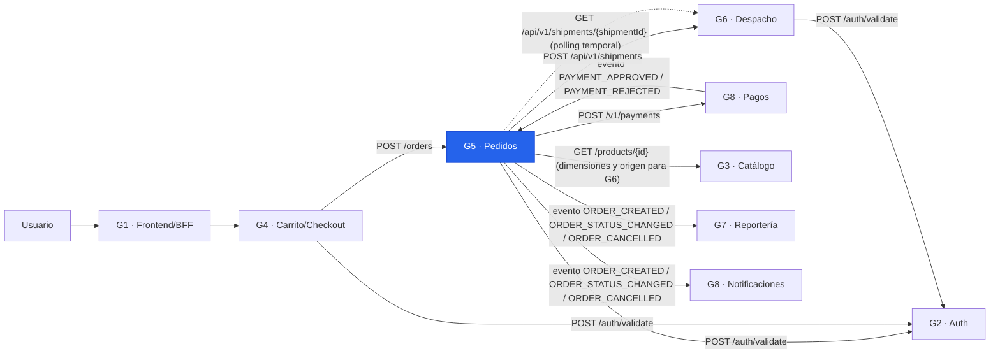
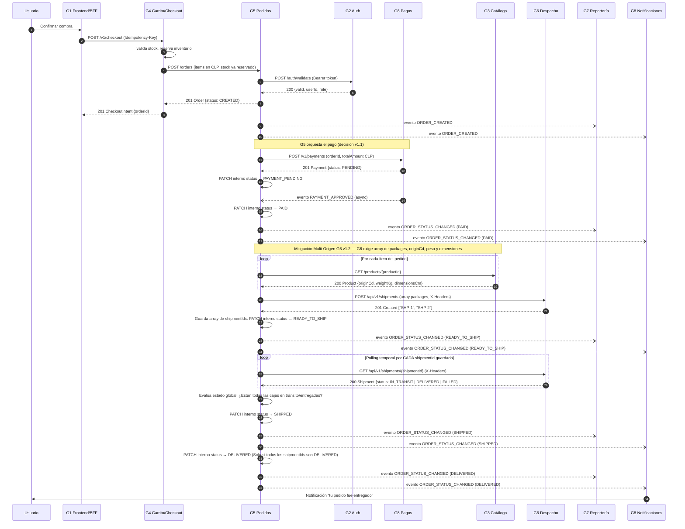
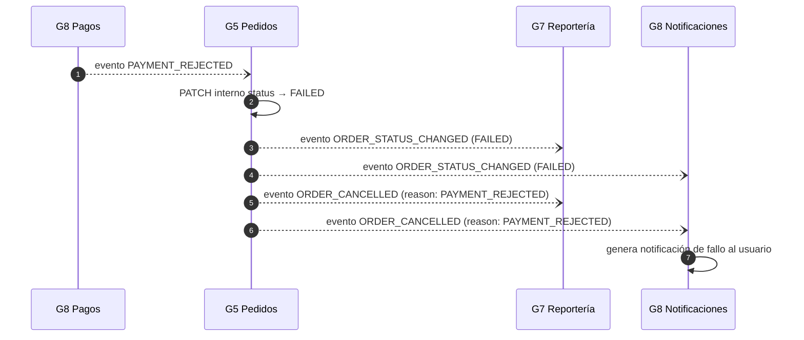
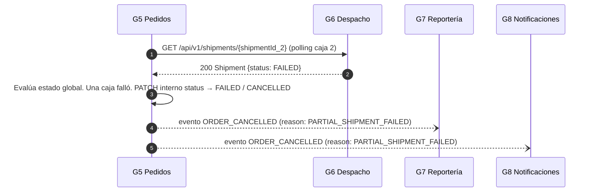

# Diagrama de Integración — Grupo 5: Pedidos

## 1. Diagrama de componentes (C1 — contexto del sistema)

---

## 2. Diagrama de secuencia (C2 — flujo end-to-end del pedido)

---

## 3. Caso alternativo: pago rechazado

---

## 4. Caso alternativo: fallo parcial en despacho (Multi-Origen)

---

## 5. Notas de lectura

* Las flechas `-->` / `->>` son llamadas REST síncronas; las `--)` son eventos asíncronos (Pub/Sub).
* La validación JWT contra G2 ocurre en cada request entrante a G5.
* Mitigación Logística v1.2: El servicio de G6 ahora devuelve un arreglo de cajas físicas (Multi-Origen). Debido a esto, el **polling temporal** debe iterar sobre la ruta `/api/v1/shipments/{shipmentId}` para cada caja.
* La transición de la orden a `SHIPPED` o `DELIVERED` en G5 **depende estrictamente** de la agregación de los estados de todos sus `shipmentIds`. Si una caja de tres falla, el pedido general no puede marcarse como entregado.
